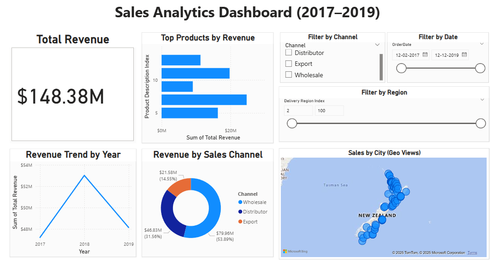

# 📊 Sales Analytics Dashboard (Power BI)

This Power BI dashboard analyzes a company’s sales data from **2017–2019**, providing clear insights into revenue trends, top-performing products, sales channels, and geographic distribution using interactive visuals and slicers.

---

## 🔍 Project Objective

To build a dynamic and professional dashboard that enables users to:
- Track total sales over time
- Identify top-selling products
- Compare performance across sales channels
- Analyze regional trends using map visuals
- Filter data interactively by date, channel, and region

---

## 📁 Files Included

- `Sales_Analytics_Dashboard.pbix` – Power BI project file  
- `Sales_Data.xlsx` – Source dataset  
- `Dashboard_Screenshot.png` – Visual preview  
- `Sales_Analytics_Report.pdf` – Exported report (PDF format)

---

## 🛠️ Tools & Technologies

- **Power BI Desktop**  
- **DAX** (basic calculated columns and formatting)  
- **Excel** (data prep)  
- **Data Modeling**

---

## 📈 Key Features

- ✅ KPI Card: Total Revenue (>$22M)  
- 📉 Line Chart: Revenue trend by year  
- 📦 Bar Chart: Top 5 products by revenue  
- 🌍 Map Visual: Sales by delivery city using geo-coordinates  
- 🍩 Donut Chart: Channel-wise performance  
- 🎛️ Slicers: Date, Channel, and Region filters  
- 🎨 Custom layout and formatting for a polished look

---

## 📌 Skills Demonstrated

- Data visualization & storytelling  
- DAX for calculated fields  
- Geo mapping (Latitude/Longitude)  
- Clean UI/UX dashboard design  
- Extracting business insights from raw data

---

## 📷 Dashboard Preview

---

## 🔗 View Exported Report

[Click here to view the dashboard PDF](Sales_Analytics_Report.pdf)
